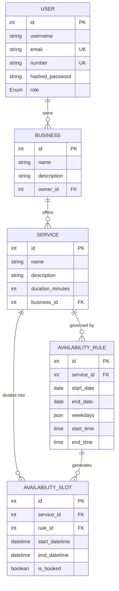

# 📅 Slotify

Slotify is a robust, slot-based service booking engine API built with **FastAPI**, **SQLAlchemy**, and **PostgreSQL**. It is designed to support multi-tenant business structures, allowing administrators to manage businesses and service availability via customized rules and slots.

---

## 🚀 Features

- **Role-Based Authorization:** Supports `admin` and `customer` roles.
- **Multi-Tenant Businesses:** Admins can create and manage their own businesses.
- **Service Management:** Admins can define various services offered by their business, specifying durations.
- **Flexible Availability Rules:** Define weekly recurring availability (specific weekdays, date ranges, and time windows) for any service.
- **Availability Slots:** Generated based on availability rules with unique constraints to prevent double-booking.
- **JWT-Based Authentication:** Standard OAuth2 password flow with secure password hashing (`bcrypt`) and JWT access tokens.

---

## 📁 Directory Structure

```text
Slotify/
├── backend/
│   ├── app/
│   │   ├── api/
│   │   │   ├── routes/              # FastAPI Router definitions
│   │   │   │   ├── auth.py          # Authentication (login) route
│   │   │   │   ├── availability_rule.py
│   │   │   │   ├── business.py      # Business registration route
│   │   │   │   ├── service.py       # Business service registration route
│   │   │   │   └── user.py          # User registration & user profile routes
│   │   │   └── deps.py              # Auth & dependency injection helpers
│   │   ├── core/
│   │   │   └── security.py          # Password hashing and JWT generation
│   │   ├── db/
│   │   │   ├── base.py              # SQLAlchemy base declarative model
│   │   │   └── session.py           # Database connection & session factory
│   │   ├── models/                  # SQLAlchemy ORM schemas
│   │   │   ├── availability_rule.py
│   │   │   ├── availability_slot.py
│   │   │   ├── business.py
│   │   │   ├── service.py
│   │   │   └── user.py
│   │   ├── schemas/                 # Pydantic data validation schemas
│   │   │   ├── availability_rule.py
│   │   │   ├── business.py
│   │   │   ├── services.py
│   │   │   └── user.py
│   │   ├── services/                # Business logic services layer
│   │   │   ├── auth_service.py
│   │   │   ├── availability_rule_service.py
│   │   │   ├── business_service.py
│   │   │   ├── service_service.py
│   │   │   └── user_services.py
│   │   ├── main.py                  # Primary application entrypoint
│   │   └── main2.py                 # Alternative lightweight routing entrypoint
├── docs/                            # Documentation files (currently empty)
├── frontend/                        # Frontend UI files (currently empty)
├── requirements.txt                 # Python project dependencies
└── README.md                        # Project documentation (this file)
```

---

## 📊 Database Architecture

The data model uses PostgreSQL with SQLAlchemy. The relationship between entities is visualized below:



---

## 🔌 API Endpoints Reference

### 🔐 Authentication & Users

| Endpoint | Method | Description | Access Control | Request Body Schema |
| :--- | :--- | :--- | :--- | :--- |
| `/users` | `POST` | Register a new user | Public | `UserCreate` |
| `/login` | `POST` | Authenticate credentials & get JWT token | Public | `OAuth2PasswordRequestForm` |
| `/me` | `GET` | Get details of currently logged-in user | Authenticated | None |

### 🏢 Businesses & Services

| Endpoint | Method | Description | Access Control | Request Body Schema |
| :--- | :--- | :--- | :--- | :--- |
| `/business` | `POST` | Create a new business owned by current user | Admins Only | `BusinessCreate` |
| `/services/businesses/{business_id}/services` | `POST` | Add a service offered by the business | Admin Owner | `ServiceCreate` |

### 📅 Availability Rules & Slots

| Endpoint | Method | Description | Access Control | Request Body Schema |
| :--- | :--- | :--- | :--- | :--- |
| `/services/{service_id}/availability-rules` | `POST` | Create a rule governing slot generation for a service | Admin Owner | `AvailabilityRuleCreate` |

---

## 🛠️ Installation & Setup

### Prerequisites

- Python 3.10+
- PostgreSQL database instance

### Setup Instructions

1. **Clone the Repository & Navigate to the Project Root:**
   ```bash
   cd Slotify
   ```

2. **Set Up a Virtual Environment:**
   ```bash
   python -m venv .venv
   source .venv/bin/activate  # On Windows: .venv\Scripts\activate
   ```

3. **Install Dependencies:**
   ```bash
   pip install -r requirements.txt
   ```

4. **Database Configuration:**
   Modify the database connection URL in [session.py](file:///C:/Users/hp/OneDrive/Desktop/Projects/Slotify/backend/app/db/session.py) (or configure it via environment variables):
   ```python
   DATABASE_URL = "postgresql://<username>:<password>@localhost:5432/slotify_db"
   ```

5. **Run the Application:**
   Run the development server using Uvicorn:
   ```bash
   cd backend
   uvicorn app.main:app --reload
   ```

6. **Interactive Documentation:**
   Open your browser and navigate to:
   - Swagger UI: [http://127.0.0.1:8000/docs](http://127.0.0.1:8000/docs)
   - ReDoc: [http://127.0.0.1:8000/redoc](http://127.0.0.1:8000/redoc)

---

## 🏗️ Future Work

- **Frontend Application:** Build a React or Vue client in the `/frontend` directory to interface with the backend.
- **Availability Rule Engine:** Complete the `create_availability_rule_service` implementation to generate `AvailabilitySlot` entities automatically when a new rule is applied.
- **Booking Engine:** Add endpoints to allow customers to book existing open slots.
